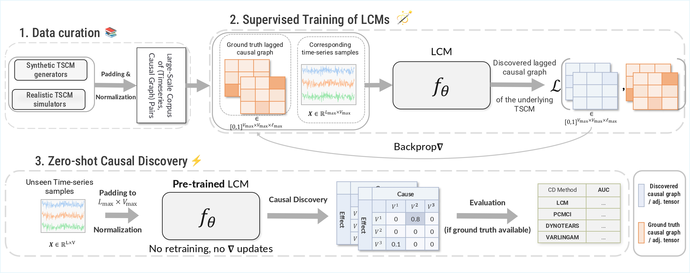
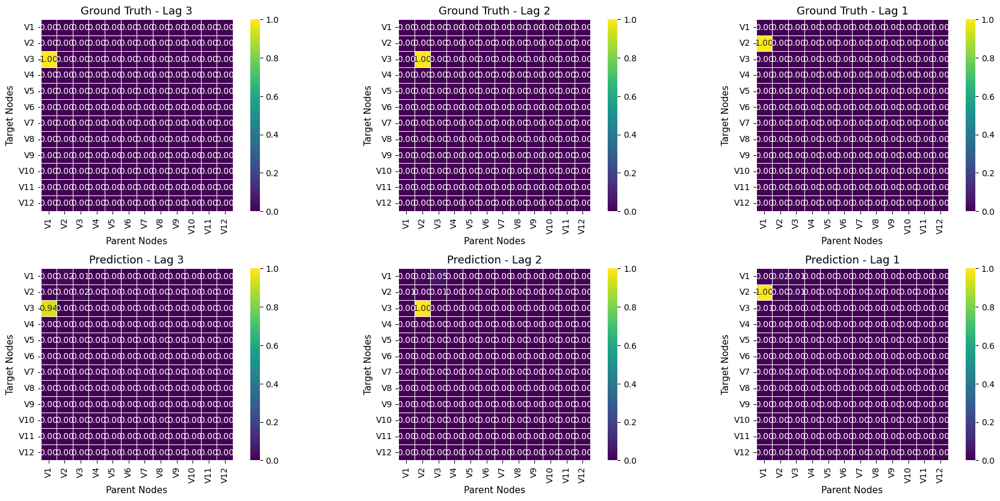
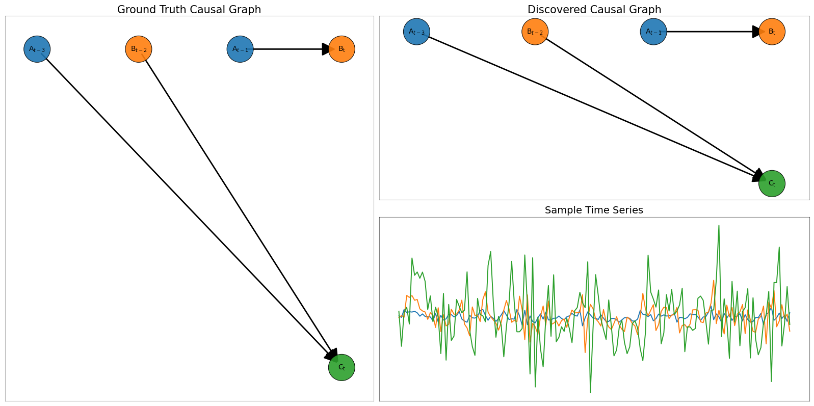

# Large Causal Models for Temporal Causal Discovery

<p align="center">
  <em>Scalable • Robust • Multi-domain • Pre-trained</em>
</p>

<div align="center">

[](https://www.codefactor.io/repository/github/kougioulis/LCM-paper)


[](https://github.com/kougioulis/large-causal-models/blob/main/LICENSE)
</div>

Reproducibility experiments for the paper *"Large Causal Models for Temporal Causal Discovery*.

---



---

<div align="center">

| Classical Paradigm                       | Large Causal Models              |
| -----------------------------------------| -------------------------------- |
| One model per dataset                    | One model, many datasets         |
| No pretraining                           | Massive multi-domain pretraining |
| Brittle to domain shift                  | Robust & transferable            |
| Slow inference for larger inputs         | Fast inference                   |

</div>

---

## Abstract

Causal discovery for both cross-sectional and temporal data has traditionally followed a dataset-specific paradigm, where a new model is fitted for each individual dataset. Such an approach limits the potential of multi-dataset pretraining.  The concept of *large causal models (LCMs)* envisions a class of pre-trained neural architectures specifically designed for temporal causal discovery. Prior approaches are constrained to small variable counts, degrade with larger inputs, and rely heavily on synthetic data, limiting generalization. We propose a principled framework for LCMs, combining diverse synthetic generators with realistic time-series datasets, allowing learning at scale. Extensive experiments on synthetic, semi-synthetic and realistic benchmarks show that LCMs scale effectively to higher variable counts and deeper architectures while maintaining strong performance. Trained models achieve competitive or superior accuracy compared to classical and neural baselines, particularly in out-of-distribution settings, while enabling fast, single-pass inference. Results demonstrate LCMs as a promising foundation-model paradigm for temporal causal discovery.

---

## Setup & Getting Started 

### Conda Environment 🐍

We provide a conda environment for reproducibility purposes only. One can create a virtual conda environment using

- `conda env create -f environment.yaml`
- `conda activate LCM` 

### Using pip

Alternatively, you can just install the dependencies from the `requirements.txt` file using pip, either on your base environment or into an existing conda environment by

- `pip install -r requirements.txt`

---

## Notebooks

`experimental_results.ipynb` contains the experimental results of Section 6.5.

`illustrative_example.ipynb` contains an example of loading a pre-trained LCM, preprocessing a simple synthetic input time-series data and performing causal discovery. It illustrates both the discovered lagged causal graph, as well as the confidence weights of the lagged adjacency tensor and the $AUC$ of the model.

`ablation_experiments.ipynb` contains ablation and zero-shot experiments on assessing the optimal mixture of realistic and synthetic training data.

| Notebook                     | Description                                | Section |
| ---------------------------- | ------------------------------------------ | -------------- |
| `experimental_results.ipynb` | Main experimental benchmarks               | §8.3           |
| `illustrative_example.ipynb` | Loading a pretrained LCM & performing CD   | Appendix       |
| `ablation_experiments.ipynb` | Ablations & optimal training data mixture  | §8.1, 8.2      |

Presented results (in `CSV` format) are available under `outputs/`.

---


## ✨ Pretrained Models

Due to GitHub size limitations, pretrained checkpoints are hosted externally on Google Drive. Provided models handle up to $V_{\max}=12$ variables, maximum lag $\ell_{\max}=3$ and $L=500$ timesteps.

| Model     | Parameters | Link                                                                                              |
| --------- | ---------- | ------------------------------------------------------------------------------------------------- |
| LCM-2.5M (small) | 2.5M       | [Download](https://drive.google.com/file/d/1vjzKMpr7M_feQuFgZGSb5VWRJ_7psV0v/view?usp=sharing)    |
| LCM-9.4M (base) | 9.4M       | [Download](https://drive.google.com/file/d/1UCjLG4Hs6MKSJF_5G3MJmTlhGQVp3qx7/view?usp=drive_link) |
| LCM-12.2M | 12.2M      | [Download](https://drive.google.com/file/d/1bLKASu085xBJ0oqWbhNObcDie94eZFzR/view?usp=sharing)    |
| LCM-24M (large)  | 24M        | [Download](https://drive.google.com/file/d/10gARotO3pK-bYnvpESNBlIV94SqxLxmw/view?usp=drive_link) |

---

## Quick Start

This section shows how to load a pretrained Large Causal Model and perform causal discovery on a small illustrative time-series example. The goal is to demonstrate the minimal workflow. For a more complete notebook, see `illustrative_example.ipynb`.

---

### 1. Load a Pretrained Model

```python
from pathlib import Path
import sys
import torch
sys.path.append("..")  # add project root to PYTHONPATH

from src.modules.lcm_module import LCMModule

model_path = Path("/path/to/pretrained/checkpoints")  # adjust as needed

# Load model
model = LCMModule.load_from_checkpoint(model_path / "LCM_2.5M.ckpt")

device = "cpu"
M = model.model.to(device).eval()
```

---

### 2. Generate Example Data

We now perform causal discovery on a 3-variable time-series generated from the temporal SCM (TSCM):

* $V_1(t) = \epsilon(t)$
* $V_2(t) = 3V_1(t-1) + \epsilon(t)$
* $V_3(t) = V_2(t-2) + 5V_1(t-3) + \epsilon(t)$

where $\epsilon(t)$ is independent Gaussian noise. Thus, the true causal graph corresponds to:

* $V_1 \rightarrow V_2$ (with lag 1)
* $V_1 \rightarrow V_3$ (with lag 3)
* $V_2 \rightarrow V_3$ (with lag 2)

```python
from src.utils.misc_utils import run_illustrative_example

# Model-specific params
MAX_SEQ_LEN = 500
MAX_LAG = 3
MAX_VAR = 12

X_cpd, Y_cpd = run_illustrative_example(n=MAX_SEQ_LEN)
X_cpd = torch.tensor(X_cpd.values, dtype=torch.float32)
```

`run_illustrative_example()` returns (i) a time-series dataset of shape `[T, 3]` (ii) the corresponding binary lagged adjacency tensor for the ground-truth causal graph. Interpretation: `pred[j,i,l] = 1` means variable `i` causes variable `j` at lag `ℓ_max - l`.

---

### 3. Preprocess (Normalize + Pad)

LCMs support up to $V_{\max}=12$ variables, $L_{\max}=500$ timesteps, and causal lags up to $\ell_{\max}=3$. For smaller inputs, we pad in both time and feature dimensions.

```python
# Normalize
X_cpd = (X_cpd - X_cpd.min()) / (X_cpd.max() - X_cpd.min())

# Timesteps padding
if X_cpd.shape[0] < MAX_SEQ_LEN:
    X_cpd = torch.cat([
        X_cpd,
        torch.normal(0, 0.01, (MAX_SEQ_LEN - X_cpd.shape[0], X_cpd.shape[1]))
    ], dim=0)

# Feature + lag padding
VAR_DIF, LAG_DIF = MAX_VAR - X_cpd.shape[1], MAX_LAG - Y_cpd.shape[2]
if VAR_DIF > 0:
    X_cpd = torch.cat([
        X_cpd,
        torch.normal(0, 0.01, (X_cpd.shape[0], VAR_DIF))
    ], dim=1)
    Y_cpd = torch.nn.functional.pad(Y_cpd, (0, 0, 0, VAR_DIF, 0, VAR_DIF), value=0.0)
```

---

### 4. Perform Causal Discovery

```python
from src.utils.utils import lagged_batch_crosscorrelation

with torch.no_grad():
    corr = lagged_batch_crosscorrelation(X_cpd.unsqueeze(0), MAX_LAG)
    pred = torch.sigmoid(M((X_cpd.unsqueeze(0), corr)))
    
    # Remove self-loops for each lag
    for l in range(pred.shape[-1]):
        pred[:, l, l] = 0
```

`pred` is a lagged adjacency tensor where higher values = higher confidence in a directed causal link at a given lag.

---

### 5. Evaluate Causal Discovery Performance

```python
from src.utils.metrics import custom_binary_metrics

print(f"AUC: {custom_binary_metrics(pred, Y_cpd)[0]}")
```

The model succesfully discovers all causal effects, resulting in a perfect AUC score. We can also visualize lag-wise heatmaps against the known ground truth:

```python
plot_adjacency_heatmaps(
    pred_adj=pred.squeeze(0),
    true_adj=Y_cpd,
    absolute_errors=False
)
```




```python
plot_comparison_fancy(label_lagged=Y_cpd, pred_lagged=pred.squeeze(0), X=X_cpd)
```




☝️ For additional experiments (ablations, zero-shot transfer, realistic datasets), refer to the accompanying notebook (`illustrative_example.ipynb`).


---

## FAQ

<details>
  <summary><i>What causal assumptions do LCMs make?</i></summary>

LCMs rely on standard causal assumptions to ensure discovered graphs are interpretable and causal conclusions are valid. Specifically, the assumptions are:

1. **Causal Markov Condition**  
2. **Faithfulness**  
3. **Causal Sufficiency** (no latent confounding variables)  
4. **No contemporaneous effects** (i.e., no intra-lag causality; for example, no hourly causal effects when daily causation is assumed)

</details>

<details>
  <summary><i>The maximum number of input variables is 12. What if my dataset has more variables?</i></summary>

We believe this input bound reflects a practical trade-off between robust model performance and generalization, allowing application to real-world scenarios. Since causal graphs are in general parse, we recommend first applying a time-series feature selection method (e.g., *Chronoepilogi*), and then performing causal discovery on the reduced variable set.

</details>


# Datasets

We additionally provide the test sets for the experimental evaluations present in the text, available via Google Drive links. The fMRI collections are available in the `data` folder.

<details>
<summary><strong>Synthetic</strong></summary>

<br>

| Dataset | Description | Link |
|---|---|---|
| Synthetic_1 (S_Joint) | 3–5 variables | [📁 Google Drive](https://drive.google.com/drive/folders/1RB7umIQH2H3F-kIUWVvVJzJfgv12Sxy8) |
| Synthetic_2 (Synth_230K) | 3–12 variables | [📁 Google Drive](https://drive.google.com/drive/folders/1iqwnrMHx8sXWJRd6iysrKg13b-PCwwJs) |
| CDML (Lawrence et al., 2020) | 4-11 variables | [📁 Google Drive](https://drive.google.com/drive/folders/1EOIg5J3u_HAHBXP-S7Kgl_cOsG2KjYNn) |

</details>

---

<details>
<summary><strong>Semi-Synthetic <em>(Out-of-distribution — Zero-shot)</em></strong></summary>

<br>

| Dataset | Link |
|---|---|
| fMRI-5 | [📁 GitHub](https://github.com/kougioulis/LCM-paper/tree/main/data/fMRI_5) |
| fMRI | [📁 GitHub](https://github.com/kougioulis/LCM-paper/tree/main/data/fMRI) |
| Kuramoto-5 | [📁 Google Drive](https://drive.google.com/drive/folders/1Jh9e7o4c60MDkHykX4tJvjwfWZ-khC8f) |
| Kuramoto-10 | [📁 Google Drive](https://drive.google.com/drive/folders/1MT3u0xvk2Wg9C0QRJ78FF5VMFCFZeKhc) |

</details>

---

<details>
<summary><strong>Realistic</strong></summary>

<br>

| Dataset | Setting | Link |
|---|---|---|
| SIM | In-distribution | [📁 Google Drive](https://drive.google.com/drive/folders/1VRi2q4VH7bgxv56lCLOZlUr12sVAyYka) |
| AirQualityMS | Zero-shot | [📁 Google Drive](https://drive.google.com/drive/folders/15Ix7n-zIRKtJBZUTyfvtkI9bzKtl4M1O) |
| Garments | Zero-shot | [📁 Google Drive](https://drive.google.com/drive/folders/1vzrJF4egNdOyfsAvH4BUQkBtRJTs9O2v) |
| Power | Zero-shot | [📁 Google Drive](https://drive.google.com/drive/folders/1-pwIB9bKETI394uF36gDvqvG8D6E0u1x) |
| Gearbox | Zero-shot | [📁 Google Drive](https://drive.google.com/drive/folders/1pKqvtl_1ptybtj3uADT5OaPifTS6wn5X) |
| Climate | Zero-shot | [📁 Google Drive](https://drive.google.com/drive/folders/1j2SKdKoGPOSB7rzCR8fOP5XVROVWux43) |
| ETTm2 | Zero-shot | [📁 Google Drive](https://drive.google.com/drive/folders/1C4Nj9Tc67-L8FSrRF9UU8f5LU8ywGFMP) |

</details>

---

<details>
<summary><strong>Mixture Collection <em>(Holdout for large-scale models)</em></strong></summary>

<br>

| Dataset | Description | Link |
|---|---|---|
| LS | Large-scale | [📁 Google Drive](https://drive.google.com/drive/folders/1k0cXzh8PgNX5eY3nSpb6vBYPCiYQFRm9) |

</details>
---

# Citation

If you find this work useful, please cite:

```bibtex
@article{kougioulis2026large,
      title={Large Causal Models for Temporal Causal Discovery}, 
      author={Nikolaos Kougioulis and Nikolaos Gkorgkolis and MingXue Wang and Bora Caglayan and Dario Simionato and Andrea Tonon and Ioannis Tsamardinos},
      year={2026},
      eprint={2602.18662},
      archivePrefix={arXiv},
      primaryClass={cs.LG},
      url={https://arxiv.org/abs/2602.18662}
}
```